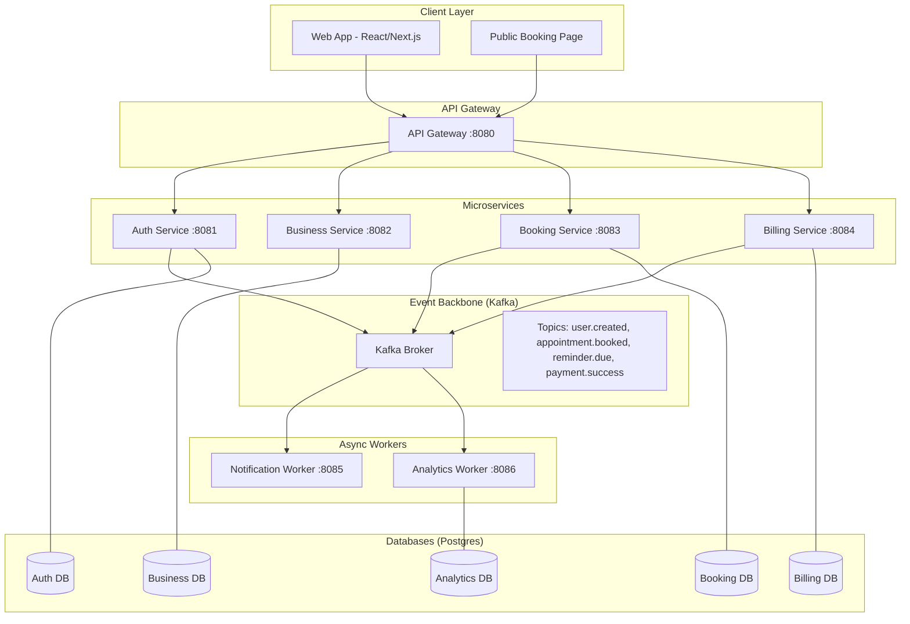

# Project Specification: Appointment & Reminder SaaS

## 1. Project Overview
**Name:** ApptRemind (Placeholder)
**Goal:** A B2B SaaS platform enabling small businesses (salons, clinics, tutors) to manage appointments, staff calendars, and automated customer reminders (Email/SMS).
**Architecture Style:** Event-Driven Microservices.
**Language:** Golang (high performance, strong backend concurrency support).
**Infrastructure:** Docker, Docker Compose (for local free environment), PostgreSQL, Kafka.

## 2. Tech Stack
*   **Language:** Go (Golang) 1.21+
*   **Framework:** Gin (HTTP Web Framework) or standard `net/http`.
*   **Database:** PostgreSQL 15 (Official Docker Image).
*   **Event Streaming:** Apache Kafka (confluentinc/cp-kafka or bitnami/kafka).
*   **Containerization:** Docker & Docker Compose.
*   **Cache/Rate Limiter:** Redis (optional but recommended for performance).
*   **Email Provider (Free Tier Integration):** Mailtrap (for dev) or SendGrid (free tier).
*   **SMS Provider (Integration):** Twilio (free tier logic) or mock implementation.
*   **Payment Gateway:** Stripe (Test Mode).
*   **API Documentation:** Swagger/OpenAPI (swaggo).

## 3. Architecture Diagram



## 4. Microservices Breakdown

### 4.1 API Gateway Service (`gateway-service`)
*   **Port:** 8080
*   **Responsibilities:**
    *   Route requests to appropriate services.
    *   Handle JWT Validation (Authentication middleware).
    *   CORS handling.
    *   Rate limiting (basic implementation).
*   **Tech:** Go + Gin.

### 4.2 Auth Service (`auth-service`)
*   **Port:** 8081
*   **Database:** `auth_db`
*   **Responsibilities:**
    *   User Registration (Business Owners & Staff).
    *   Login (JWT generation).
    *   Password Reset (Password reset tokens via events).
*   **Key Events Published:**
    *   `user.created`: { user_id, email, role }
    *   `user.password_reset_requested`: { email, token }

### 4.3 Business Service (`business-service`)
*   **Port:** 8082
*   **Database:** `business_db`
*   **Responsibilities:**
    *   Manage Business Profiles (Name, Address, Timezone).
    *   Manage Services (Service Name, Duration, Price, Description).
    *   Manage Staff (Staff Name, Working Hours).
    *   Configure Global Settings (Reminder timings: e.g., 24h before, 1h before).
*   **Note:** This service holds the "Master Data" for what can be booked.

### 4.4 Booking Service (`booking-service`)
*   **Port:** 8083
*   **Database:** `booking_db`
*   **Responsibilities:**
    *   Slot Availability Logic (Complex time logic).
    *   Create Appointment (Check for double booking).
    *   Cancel Appointment.
    *   Get Calendar (List of slots).
    *   **CRITICAL:** When an appointment is booked, calculate exact reminder times and store them in a `reminders` table or push to a scheduler topic.
*   **Key Events Published:**
    *   `appointment.booked`: { appointment_id, customer_email, customer_phone, time, service_name, business_id }
    *   `appointment.cancelled`: { appointment_id }
    *   `reminder.due`: { appointment_id, type (email/sms), recipient }

### 4.5 Billing Service (`billing-service`)
*   **Port:** 8084
*   **Database:** `billing_db`
*   **Responsibilities:**
    *   Manage Subscriptions (Free vs Pro).
    *   Webhook handler for Stripe.
    *   Invoicing logic.
*   **Key Events Published:**
    *   `subscription.upgraded`: { business_id, tier }
    *   `invoice.generated`: { business_id, amount }

### 4.6 Notification Worker (`notification-worker`)
*   **Port:** 8085
*   **Database:** None (Reads from Kafka, calls external APIs).
*   **Responsibilities:**
    *   Consumes `reminder.due` events.
    *   Formats Email/SMS templates.
    *   Calls SendGrid/Twilio APIs.
    *   Handles retries (Exponential Backoff) in Kafka config or internal logic.
*   **Key Events Published:**
    *   `notification.sent`: { appointment_id, channel, status }
    *   `notification.failed`: { appointment_id, error_reason }

### 4.7 Analytics Worker (`analytics-worker`)
*   **Port:** 8086
*   **Database:** `analytics_db`
*   **Responsibilities:**
    *   Consumes `appointment.booked`, `appointment.cancelled`, `notification.sent`.
    *   Updates aggregated tables (Daily Appointments, No-show rates).
    *   Materialized view for Dashboard.

## 5. Database Schemas (PostgreSQL SQL)

### 5.1 Auth DB (`auth_db`)
```sql
CREATE TABLE users (
    id SERIAL PRIMARY KEY,
    business_id UUID NOT NULL, -- Linked to business profile
    email VARCHAR(255) UNIQUE NOT NULL,
    password_hash VARCHAR(255) NOT NULL,
    role VARCHAR(50) NOT NULL, -- 'owner', 'staff', 'admin'
    created_at TIMESTAMP DEFAULT CURRENT_TIMESTAMP
);

CREATE INDEX idx_users_email ON users(email);
```

### 5.2 Business DB (`business_db`)
```sql
CREATE TABLE businesses (
    id UUID PRIMARY KEY DEFAULT gen_random_uuid(),
    owner_id INT NOT NULL, -- Link to Auth User
    name VARCHAR(255) NOT NULL,
    timezone VARCHAR(100) DEFAULT 'UTC',
    subscription_tier VARCHAR(50) DEFAULT 'free', -- 'free', 'pro'
    created_at TIMESTAMP DEFAULT CURRENT_TIMESTAMP
);

CREATE TABLE services (
    id UUID PRIMARY KEY DEFAULT gen_random_uuid(),
    business_id UUID REFERENCES businesses(id),
    name VARCHAR(255) NOT NULL,
    duration_minutes INT NOT NULL,
    price DECIMAL(10, 2) NOT NULL,
    description TEXT
);

CREATE TABLE staff (
    id UUID PRIMARY KEY DEFAULT gen_random_uuid(),
    business_id UUID REFERENCES businesses(id),
    name VARCHAR(255) NOT NULL,
    is_active BOOLEAN DEFAULT true
);

CREATE TABLE staff_working_hours (
    id SERIAL PRIMARY KEY,
    staff_id UUID REFERENCES staff(id),
    day_of_week INT NOT NULL, -- 0 (Mon) to 6 (Sun)
    start_time TIME NOT NULL,
    end_time TIME NOT NULL,
    UNIQUE(staff_id, day_of_week)
);
```

### 5.3 Booking DB (`booking_db`)
```sql
CREATE TABLE appointments (
    id UUID PRIMARY KEY DEFAULT gen_random_uuid(),
    business_id UUID NOT NULL,
    service_id UUID NOT NULL,
    staff_id UUID NOT NULL,
    customer_name VARCHAR(255) NOT NULL,
    customer_email VARCHAR(255),
    customer_phone VARCHAR(50),
    start_time TIMESTAMP WITH TIME ZONE NOT NULL,
    end_time TIMESTAMP WITH TIME ZONE NOT NULL,
    status VARCHAR(50) DEFAULT 'booked', -- 'booked', 'cancelled', 'completed'
    created_at TIMESTAMP DEFAULT CURRENT_TIMESTAMP
);

CREATE INDEX idx_appointments_staff_time ON appointments(staff_id, start_time);
CREATE INDEX idx_appointments_business_time ON appointments(business_id, start_time);

CREATE TABLE reminders (
    id SERIAL PRIMARY KEY,
    appointment_id UUID REFERENCES appointments(id),
    remind_at TIMESTAMP WITH TIME ZONE NOT NULL,
    status VARCHAR(50) DEFAULT 'pending', -- 'pending', 'sent', 'failed'
    type VARCHAR(20) NOT NULL -- 'email', 'sms'
);
```

## 6. Kafka Event Schemas

All events should be JSON.

### 6.1 `appointment.booked`
```json
{
  "event_type": "appointment.booked",
  "timestamp": "2023-10-27T10:00:00Z",
  "data": {
    "appointment_id": "uuid-1234",
    "business_id": "uuid-biz",
    "staff_id": "uuid-staff",
    "customer_email": "client@example.com",
    "customer_phone": "+123456789",
    "service_name": "Haircut",
    "start_time": "2023-10-28T14:00:00Z",
    "reminder_times": ["2023-10-27T14:00:00Z", "2023-10-28T13:00:00Z"]
  }
}
```

### 6.2 `reminder.due`
*Produced by a scheduler component inside Booking Service or a Worker that polls the `reminders` table.*
```json
{
  "event_type": "reminder.due",
  "timestamp": "2023-10-27T14:00:00Z",
  "data": {
    "appointment_id": "uuid-1234",
    "type": "email",
    "recipient": "client@example.com",
    "template_data": {
      "business_name": "Salon X",
      "time": "Oct 28, 2:00 PM",
      "service": "Haircut"
    }
  }
}
```

### 6.3 `notification.sent`
```json
{
  "event_type": "notification.sent",
  "timestamp": "2023-10-27T14:00:01Z",
  "data": {
    "appointment_id": "uuid-1234",
    "channel": "email",
    "provider_id": "msg-id-123"
  }
}
```

## 7. API Endpoints Specification

### Auth Service
*   `POST /api/v1/auth/register` - { email, password, business_name }
*   `POST /api/v1/auth/login` - { email, password } -> Returns JWT

### Business Service
*   `GET /api/v1/business/profile` - Get current business profile
*   `POST /api/v1/business/services` - Create service (Auth required)
*   `GET /api/v1/business/services` - List services
*   `POST /api/v1/business/staff` - Add staff member
*   `GET /api/v1/business/staff` - List staff

### Booking Service
*   `GET /api/v1/public/slots?staff_id={uuid}&date={YYYY-MM-DD}` - Get available slots (Public)
*   `POST /api/v1/public/book` - Book a slot (Public) - { staff_id, service_id, time, customer_info }
*   `GET /api/v1/appointments` - List business appointments (Auth required)
*   `DELETE /api/v1/appointments/{id}` - Cancel appointment (Auth required)

### Billing Service
*   `POST /api/v1/billing/checkout` - Create Stripe Checkout Session for Upgrade
*   `GET /api/v1/billing/subscription` - Get current status

## 8. Docker Compose Structure

The `docker-compose.yml` should orchestrate:
1.  **Network:** `appt-network`
2.  **Volumes:** `postgres-data`, `kafka-data`
3.  **Services:**
    *   `postgres` (Image: postgres:15)
    *   `kafka` (Image: bitnami/kafka:latest) - Includes Zookeeper if needed, or use the combined one.
    *   `redis` (Image: redis:alpine)
    *   `gateway` (Build: ./cmd/gateway)
    *   `auth-service` (Build: ./cmd/auth)
    *   `business-service` (Build: ./cmd/business)
    *   `booking-service` (Build: ./cmd/booking)
    *   `billing-service` (Build: ./cmd/billing)
    *   `notification-worker` (Build: ./cmd/notification)
    *   `analytics-worker` (Build: ./cmd/analytics)

## 9. Implementation Priorities for Codex Agent

Phase 1: Skeleton & Auth
1.  Setup Go mod structure.
2.  Setup Docker Compose with Postgres.
3.  Implement `auth-service` with DB connection and JWT generation.

Phase 2: Business Logic
1.  Implement `business-service` CRUD.
2.  Implement `booking-service` with "Get Available Slots" logic (ignore double booking for now).

Phase 3: Event Core
1.  Setup Kafka in Docker.
2.  Produce `appointment.booked` event when booking is created.

Phase 4: Workers
1.  Implement `notification-worker` to consume `appointment.booked` (simplified flow) -> Send Email (Mock/Log first).
2.  Add actual `reminders` table logic and `reminder.due` event production.

Phase 5: Polish
1.  Add API Gateway routing.
2.  Add Stripe mock/payment logic.
3.  Add Analytics aggregation.

---
**Instruction to Agent:**
Please generate the project folder structure, Docker Compose file, and the code for the `booking-service` (Model, Handler, Kafka Producer) first.
```
