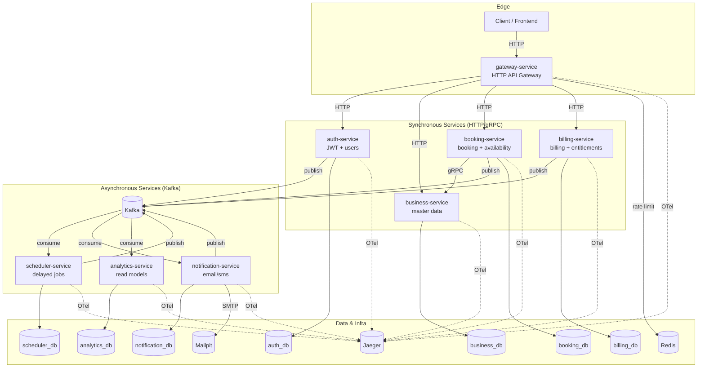
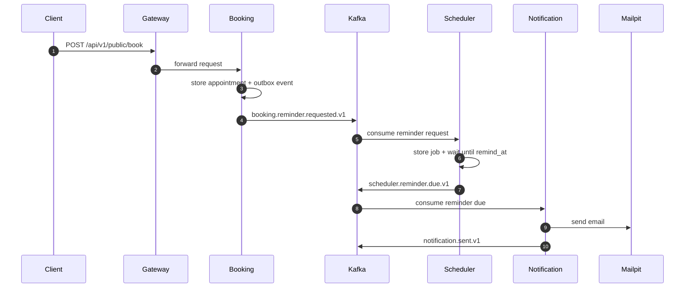
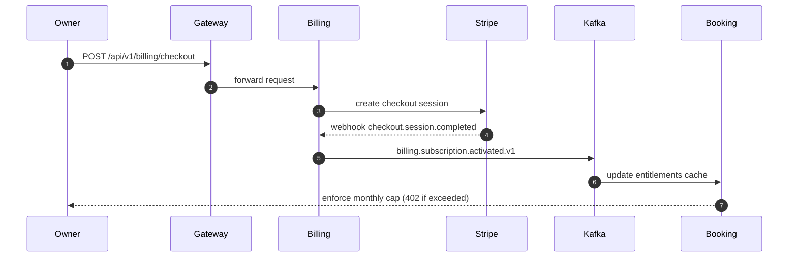
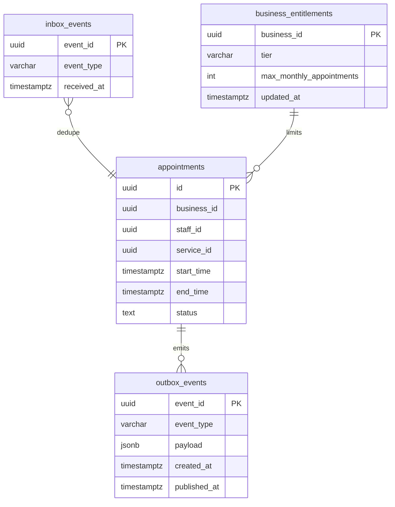
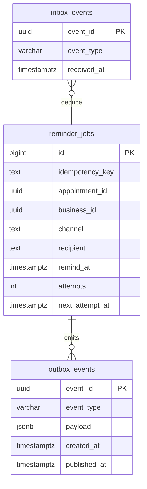
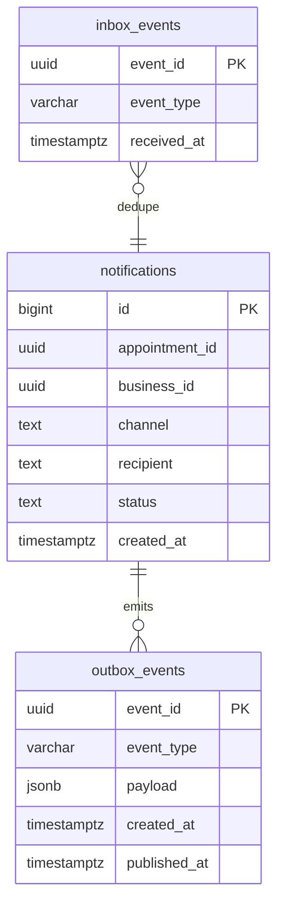

# ApptRemind

Appointment booking + reminders SaaS built as an event-driven microservices system.

## Purpose
Service businesses lose time and revenue when bookings are handled manually and customers forget appointments (no-shows).
ApptRemind solves this by providing:
- a public booking flow (availability, booking, cancellation)
- a durable scheduler for reminders
- notification delivery (email now; SMS via pluggable provider)
- subscription/billing entitlements to control usage
- analytics read models to track outcomes over time

This repo is also a production-practice learning project: it demonstrates common patterns for scalable backends (outbox/inbox, DLQ, tracing, rate limiting, etc.).
- Language: Go (services + shared libs)
- Infra: Postgres, Kafka, Redis, Mailpit, Jaeger
- Patterns: Outbox, Inbox (idempotency), Saga-style workflows, DLQ

This README is the main entry point; deeper docs live in `docs/`.

## Quick Start (Local, Docker Compose)
From the repo root:

```bash
cd deploy/compose
cp .env.example .env
# optional: STRIPE_WEBHOOK_SECRET=whsec_test
# optional: JWT_PRIVATE_KEY_PEM / JWKS_URL for RS256

docker compose up --build
```

If Kafka fails to start with a `clusterId` or `/brokers/ids/1` error, reset Kafka state:
```bash
docker compose down
docker volume rm apptremind_kafka-data
docker compose up -d
```

Health checks:
```bash
curl -sS localhost:8080/healthz
curl -sS localhost:8080/readyz
```

## Run Frontend Locally
Start the backend first (Docker Compose above), then run the admin UI:

```bash
pnpm -C apps/web dev
```

Open the admin UI:
- Admin UI: `http://localhost:3000`
- Public booking demo: `http://localhost:3000/public-demo`
- Status page: `http://localhost:3000/status`

If you prefer a production build of the UI:
```bash
pnpm -C apps/web build
pnpm -C apps/web start
```

Optional environment override:
```bash
NEXT_PUBLIC_API_BASE_URL=http://localhost:8080 pnpm -C apps/web dev
```

## End-to-End Tests (Playwright)
Make sure the backend stack is running, then run:
```bash
PLAYWRIGHT_NO_SANDBOX=1 pnpm -C apps/web exec playwright test
```

If you see a `.next/lock` error (stale build lock):
```bash
rm -f apps/web/.next/lock
```

## Key Endpoints
- Gateway OpenAPI: `http://localhost:8080/openapi`
- JWKS: `http://localhost:8080/.well-known/jwks.json`
- Swagger UI (compose): `http://localhost:8088/docs` (started automatically with `docker compose up --build`)
If you see a CORS error in Swagger UI, ensure `CORS_ALLOWED_ORIGINS` includes `http://localhost:8088` and restart:
```bash
docker compose -f deploy/compose/docker-compose.yml up -d --build gateway-service swagger-ui
```

## Services
- gateway-service: HTTP entry point, auth, RBAC, rate limits, CORS, OpenAPI
- auth-service: users, JWT issuance, refresh/rotation, audit events
- business-service: profile, services, staff, working hours, time-off; gRPC for booking
- booking-service: availability + booking + cancellations, idempotency, outbox events
- scheduler-service: durable delayed jobs for reminders, retries + DLQ
- notification-service: email (SMTP/Mailpit) + SMS (webhook) providers
- billing-service: Stripe checkout/webhooks, entitlements, subscription state
- analytics-service: read models + daily aggregates

## Architecture (System Overview)


## Data Flow (Booking → Reminder → Notification)


## Data Flow (Billing → Entitlements)


## ER Diagrams (Core Tables)

### Booking DB


### Scheduler DB


### Notification DB


## Contract Docs
- Event catalog: `docs/events.md`
- Event schemas: `docs/event-schemas/*.json`
- OpenAPI: `openapi/gateway.v1.yaml`
- Protos: `protos/`

## Running Tests
```bash
make test
make test-proto
```

Contract checks:
```bash
./scripts/check-openapi-sync.sh
./scripts/check-proto-clean.sh
./scripts/check-events-consistency.sh
./scripts/check-event-schemas.sh
```

Smoke suite (end-to-end):
```bash
./scripts/smoke-auth.sh
./scripts/smoke-availability.sh
./scripts/smoke-timeoff-overlap.sh
./scripts/smoke-booking-outside-availability.sh
./scripts/smoke-booking-reminder.sh
./scripts/smoke-notification-pipeline.sh
./scripts/smoke-billing-enforcement.sh
STRIPE_WEBHOOK_SECRET=whsec_test ./scripts/smoke-billing-stripe-webhook.sh
./scripts/smoke-gateway-rate-limit.sh
```

## Migrations
All migrate scripts share a standard runner (`scripts/migrate-service.sh`).

```bash
make migrate-auth
make migrate-business
make migrate-booking
make migrate-billing
make migrate-notification
make migrate-analytics
make migrate-scheduler
```

## Kafka
Bootstrap topics:
```bash
make bootstrap-topics
```

Publish test events:
```bash
./scripts/publish-test-event.sh
./scripts/publish-reminder-event.sh
./scripts/publish-reminder-requested.sh
./scripts/publish-scheduler-dlq.sh
```

## Observability
- Logs: JSON (slog)
- Tracing: OpenTelemetry → Jaeger (`http://localhost:16686`)

## Production Notes
- Security baseline: `docs/security.md`
- Local runbook: `docs/runbook/local-dev.md`
- Phased delivery tracker: `docs/phases.md`
- K8s skeleton (optional): `deploy/k8s/README.md`

## Frontend (Next.js + TypeScript)
Frontend plan:
- `docs/frontend/phases.md`

Run the Next.js app:
```bash
corepack enable
pnpm install
pnpm dev
```

Run the UI playground (Vite):
```bash
pnpm ui:dev
```

Generate TypeScript types from OpenAPI:
```bash
pnpm api:gen
```

## What’s Next
Backend is done and fully tested. Frontend execution plan:
- `docs/frontend/phases.md`
